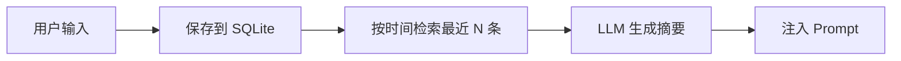
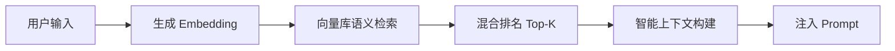

# AI 记忆系统向量库改造方案

## 1. 概述

### 1.1 目标
将当前 v1.5 基于 SQLite 的"对话日志"式记忆系统，升级为基于向量数据库的**语义记忆系统**，实现：
- **语义检索**：根据用户当前查询，智能关联历史相似对话
- **记忆压缩**：自动聚类相似对话，避免信息冗余
- **智能回忆**：跨会话、跨时间的关联回忆能力
- **槽位智能补全**：基于历史槽位数据，预测并补全当前对话缺失信息

### 1.2 核心问题
当前 `ai_conversation_history` 表的局限：
- 仅按时间顺序存储，无语义关联能力
- 检索方式固定（最近 N 条），无法灵活适配不同查询意图
- 槽位信息简单合并，无智能去重与推理
- 摘要生成依赖 LLM 实时调用，成本高且模式固定

## 2. 技术选型

### 2.1 向量数据库：**ChromaDB**
- **轻量级**：单文件存储，无需独立服务进程
- **易集成**：Python 原生支持，API 简洁
- **功能完整**：支持过滤、元数据存储、持久化
- **主流度**：GitHub 15k+ stars，LangChain 官方集成

**替代方案对比**：
- **FAISS**：检索性能极佳，但需自行管理元数据存储
- **Qdrant**：功能丰富，但需 Docker/独立服务
- **Weaviate**：企业级功能，但架构过重

### 2.2 Embedding 模型：**Sentence-Transformers**
- **模型**：`paraphrase-multilingual-MiniLM-L12-v2`
- **优势**：
  - 支持中英文混合文本
  - 本地运行，无需 API 调用
  - 模型大小仅 480MB，内存友好
  - 质量经生产验证

### 2.3 整体技术栈
```yaml
记忆系统:
  - 向量存储: ChromaDB (本地持久化)
  - Embedding: Sentence-Transformers (本地模型)
  - 元数据存储: SQLite (保留，用于结构化数据)
  - 接口兼容: 保持现有 LongMemory API
```

## 3. 架构设计

### 3.1 当前架构 (v1.5)
```
LongMemory
    ├── SQLite Storage (ai_conversation_history)
    ├── Session Manager
    ├── Summary Generator (LLM 实时调用)
    └── Slot Merger (简单 JSON 合并)
```

**数据流**：


### 3.2 新架构 (v1.6)
```
SemanticMemory
    ├── Vector Store (ChromaDB)
    │   ├── Conversation Embeddings
    │   ├── Metadata Filtering
    │   └── Semantic Search
    ├── Hybrid Storage
    │   ├── SQLite (结构化数据、会话元数据)
    │   └── ChromaDB (语义向量、对话内容)
    ├── Smart Retriever
    │   ├── 时间权重检索
    │   ├── 语义相似度检索
    │   └── 混合排名策略
    └── Memory Compressor
        ├── 对话聚类
        ├── 槽位去重
        └── 自动摘要生成
```

**数据流**：


## 4. 实现方案

### 4.1 文件结构改造
```
app/services/ai/v1_6/                    # 新版本目录
├── memory/
│   ├── __init__.py
│   ├── semantic_memory.py              # 新入口，替代 long_memory.py
│   ├── vector_store.py                 # ChromaDB 封装
│   ├── embedding_service.py            # Sentence-Transformers 封装
│   ├── retriever.py                    # 智能检索器
│   ├── compressor.py                   # 记忆压缩
│   └── hybrid_storage.py               # 混合存储协调
├── agent.py                            # 适配新 memory
└── (其他组件从 v1_5 复制)
```

### 4.2 核心接口设计

#### 4.2.1 SemanticMemory 类
```python
class SemanticMemory:
    """语义记忆管理器"""
    
    def __init__(self, user_id: int, session_id: str = None):
        self.user_id = user_id
        self.session_id = session_id or generate_session_id(user_id)
        self.vector_store = VectorStoreClient()
        self.embedder = EmbeddingService()
        
    def save_conversation(
        self,
        role: str,
        content: str,
        slots_filled: Dict[str, Any] = None,
        metadata: Dict[str, Any] = None
    ) -> str:
        """保存对话并生成向量"""
        # 1. 生成 embedding
        embedding = self.embedder.embed(content)
        
        # 2. 构建元数据
        doc_metadata = {
            "user_id": self.user_id,
            "session_id": self.session_id,
            "role": role,
            "slots": json.dumps(slots_filled) if slots_filled else "",
            "timestamp": datetime.now().isoformat(),
            **metadata
        }
        
        # 3. 存储到向量库
        doc_id = self.vector_store.add_document(
            content=content,
            embedding=embedding,
            metadata=doc_metadata
        )
        
        # 4. 同时保存到 SQLite（用于快速时间序列查询）
        save_to_sqlite(self.user_id, self.session_id, role, content, slots_filled, metadata)
        
        return doc_id
    
    def retrieve_context(
        self,
        query: str,
        strategy: str = "hybrid",
        limit: int = 5
    ) -> List[RetrievedMemory]:
        """智能检索相关历史"""
        if strategy == "semantic":
            # 纯语义检索
            return self._semantic_search(query, limit)
        elif strategy == "temporal":
            # 时间顺序检索（兼容旧模式）
            return self._temporal_search(limit)
        else:  # hybrid
            # 混合检索：语义相关性 + 时间衰减
            return self._hybrid_search(query, limit)
    
    def _hybrid_search(self, query: str, limit: int) -> List[RetrievedMemory]:
        """混合检索算法"""
        # 1. 语义搜索（权重 0.7）
        semantic_results = self._semantic_search(query, limit * 2)
        
        # 2. 时间衰减评分
        for result in semantic_results:
            time_decay = self._calculate_time_decay(result.timestamp)
            result.score = result.semantic_score * 0.7 + time_decay * 0.3
        
        # 3. 按总分排序，取 Top-K
        return sorted(semantic_results, key=lambda x: x.score, reverse=True)[:limit]
```

#### 4.2.2 EmbeddingService 类
```python
class EmbeddingService:
    """Embedding 服务，支持缓存"""
    
    def __init__(self, model_name: str = "paraphrase-multilingual-MiniLM-L12-v2"):
        self.model = None
        self.cache = LRUCache(maxsize=1000)  # 缓存最近 1000 条 embedding
        
    def embed(self, text: str) -> List[float]:
        """生成文本 embedding，带缓存"""
        # 缓存键：文本 MD5
        cache_key = hashlib.md5(text.encode()).hexdigest()
        
        if cache_key in self.cache:
            return self.cache[cache_key]
        
        # 延迟加载模型
        if self.model is None:
            from sentence_transformers import SentenceTransformer
            self.model = SentenceTransformer(model_name)
        
        embedding = self.model.encode(text).tolist()
        self.cache[cache_key] = embedding
        return embedding
    
    def batch_embed(self, texts: List[str]) -> List[List[float]]:
        """批量生成 embedding"""
        if self.model is None:
            from sentence_transformers import SentenceTransformer
            self.model = SentenceTransformer(model_name)
        
        return self.model.encode(texts).tolist()
```

#### 4.2.3 VectorStoreClient 类
```python
class VectorStoreClient:
    """ChromaDB 客户端封装"""
    
    def __init__(self, persist_directory: str = "./chroma_data"):
        import chromadb
        self.client = chromadb.PersistentClient(path=persist_directory)
        
        # 按用户分集合，便于过滤
        self.collection_name = f"user_conversations"
        self.collection = self.client.get_or_create_collection(
            name=self.collection_name,
            metadata={"hnsw:space": "cosine"}  # 余弦相似度
        )
    
    def add_document(
        self,
        content: str,
        embedding: List[float],
        metadata: Dict[str, Any]
    ) -> str:
        """添加文档到向量库"""
        from chromadb.utils import embedding_functions
        import uuid
        
        doc_id = str(uuid.uuid4())
        self.collection.add(
            ids=[doc_id],
            embeddings=[embedding],
            metadatas=[metadata],
            documents=[content]
        )
        return doc_id
    
    def semantic_search(
        self,
        query_embedding: List[float],
        filter_dict: Dict[str, Any] = None,
        limit: int = 10
    ) -> List[Dict[str, Any]]:
        """语义相似度搜索"""
        results = self.collection.query(
            query_embeddings=[query_embedding],
            n_results=limit,
            where=filter_dict,  # 过滤条件，如 {"user_id": 1}
            include=["metadatas", "documents", "distances"]
        )
        
        return [
            {
                "id": results["ids"][0][i],
                "content": results["documents"][0][i],
                "metadata": results["metadatas"][0][i],
                "score": 1 - results["distances"][0][i]  # 转换为相似度分数
            }
            for i in range(len(results["ids"][0]))
        ]
```

### 4.3 智能检索策略

#### 4.3.1 混合检索算法
```python
def hybrid_retrieve(
    query: str,
    user_id: int,
    session_id: str = None,
    strategy_config: Dict[str, Any] = None
) -> HybridRetrievalResult:
    """
    混合检索：语义 + 时间 + 槽位相关性
    
    strategy_config 示例：
    {
        "semantic_weight": 0.6,
        "temporal_weight": 0.25,
        "slot_weight": 0.15,
        "recency_decay_hours": 72,  # 72小时内衰减较慢
        "min_semantic_score": 0.3,   # 语义相似度最低阈值
    }
    """
    # 默认配置
    config = {
        "semantic_weight": 0.6,
        "temporal_weight": 0.25,
        "slot_weight": 0.15,
        **strategy_config or {}
    }
    
    # 1. 语义检索候选集
    semantic_candidates = semantic_search(query, user_id, limit=20)
    
    # 2. 为每个候选计算综合分数
    for candidate in semantic_candidates:
        # 语义分数（已归一化到 0-1）
        semantic_score = candidate.semantic_score
        
        # 时间衰减分数
        time_score = calculate_time_score(
            candidate.timestamp,
            decay_hours=config["recency_decay_hours"]
        )
        
        # 槽位相关性分数
        slot_score = calculate_slot_relevance(
            query_slots=extract_slots_from_query(query),
            candidate_slots=candidate.slots_filled
        )
        
        # 综合分数
        candidate.composite_score = (
            semantic_score * config["semantic_weight"] +
            time_score * config["temporal_weight"] +
            slot_score * config["slot_weight"]
        )
    
    # 3. 过滤和排序
    filtered = [
        c for c in semantic_candidates
        if c.semantic_score >= config["min_semantic_score"]
    ]
    filtered.sort(key=lambda x: x.composite_score, reverse=True)
    
    return HybridRetrievalResult(
        candidates=filtered[:10],
        strategy_used="hybrid",
        weights=config
    )
```

#### 4.3.2 时间衰减函数
```python
def calculate_time_score(timestamp: str, decay_hours: int = 72) -> float:
    """
    计算时间衰减分数
    
    衰减曲线：72小时内衰减较慢，超过后指数衰减
    分数范围：1.0（最新）→ 0.0（非常旧）
    """
    from datetime import datetime, timedelta
    
    doc_time = datetime.fromisoformat(timestamp)
    now = datetime.now()
    age_hours = (now - doc_time).total_seconds() / 3600
    
    if age_hours <= decay_hours:
        # 线性衰减：72小时内从1.0衰减到0.7
        return 1.0 - (age_hours / decay_hours) * 0.3
    else:
        # 指数衰减
        decay_rate = 0.95  # 每小时衰减5%
        return 0.7 * (decay_rate ** (age_hours - decay_hours))
```

### 4.4 记忆压缩与摘要

#### 4.4.1 对话聚类
```python
class MemoryCompressor:
    """记忆压缩器，定期聚类相似对话"""
    
    def cluster_conversations(
        self,
        user_id: int,
        days_back: int = 30
    ) -> List[ConversationCluster]:
        """
        聚类最近 N 天的对话
        
        聚类维度：
        1. 语义相似度 (embedding)
        2. 意图类型 (记账/查询/删除)
        3. 消费分类 (饮食/交通/购物等)
        4. 金额区间 (小/中/大额)
        """
        # 获取近期对话
        recent_convs = get_recent_conversations(user_id, days_back)
        
        if len(recent_convs) < 5:
            return []  # 数据太少不聚类
        
        # 提取 embedding
        texts = [conv.content for conv in recent_convs]
        embeddings = embedder.batch_embed(texts)
        
        # DBSCAN 聚类
        from sklearn.cluster import DBSCAN
        import numpy as np
        
        clustering = DBSCAN(eps=0.3, min_samples=2, metric='cosine').fit(embeddings)
        
        # 构建聚类结果
        clusters = []
        for cluster_id in set(clustering.labels_):
            if cluster_id == -1:
                continue  # 噪声点
            
            cluster_indices = np.where(clustering.labels_ == cluster_id)[0]
            cluster_convs = [recent_convs[i] for i in cluster_indices]
            
            # 生成聚类摘要
            summary = self._generate_cluster_summary(cluster_convs)
            
            clusters.append(ConversationCluster(
                cluster_id=cluster_id,
                size=len(cluster_convs),
                conversations=cluster_convs,
                summary=summary,
                representative_embedding=self._get_centroid(embeddings[cluster_indices])
            ))
        
        return clusters
    
    def _generate_cluster_summary(self, conversations: List) -> str:
        """生成聚类摘要"""
        # 提取关键信息模式
        categories = set()
        total_amount = 0
        intents = set()
        
        for conv in conversations:
            if conv.slots_filled:
                if "category" in conv.slots_filled:
                    categories.add(conv.slots_filled["category"])
                if "amount" in conv.slots_filled:
                    total_amount += abs(float(conv.slots_filled["amount"]))
            
            # 简单意图识别
            intent = self._detect_intent(conv.content)
            intents.add(intent)
        
        # 构建摘要
        summary_parts = []
        if categories:
            summary_parts.append(f"涉及分类：{', '.join(categories)}")
        if total_amount > 0:
            summary_parts.append(f"总金额：{total_amount:.2f}元")
        if intents:
            summary_parts.append(f"主要意图：{', '.join(intents)}")
        
        return f"共{len(conversations)}次相关对话。{'；'.join(summary_parts)}"
```

## 5. 集成方案

### 5.1 渐进式迁移策略

#### 阶段 1：双写双读（2-3天）
```python
# 适配层：同时写入 SQLite 和向量库
class MigrationAdapter:
    def __init__(self):
        self.legacy_storage = SQLiteStorage()  # 现有 v1.5
        self.vector_storage = VectorStorage()  # 新向量库
    
    def save_message(self, **kwargs):
        # 双写
        legacy_id = self.legacy_storage.save_message(**kwargs)
        vector_id = self.vector_storage.save_message(**kwargs)
        
        # 记录映射关系
        save_mapping(legacy_id, vector_id)
        
        return legacy_id  # 保持接口兼容
    
    def retrieve_context(self, query: str, **kwargs):
        # 双读验证
        legacy_results = self.legacy_storage.get_recent_messages(**kwargs)
        vector_results = self.vector_storage.semantic_search(query, **kwargs)
        
        # 对比验证，收集指标
        log_retrieval_comparison(legacy_results, vector_results)
        
        # 默认使用向量库结果
        return self._merge_results(legacy_results, vector_results)
```

#### 阶段 2：向量库为主（1周）
- 关闭 SQLite 写入
- 所有读取走向量库
- 保留 SQLite 作为备份/审计

#### 阶段 3：完全迁移（可选）
- 导出历史数据到向量库
- 移除 SQLite 依赖
- 清理迁移代码

### 5.2 Agent 集成
```python
# app/services/ai/v1_6/agent.py
from app.services.ai.v1_6.memory import create_semantic_memory

def process_ai_request(user_text: str, user_id: int, session_id: str = None) -> dict:
    # 创建语义记忆实例
    memory = create_semantic_memory(user_id, session_id)
    
    # 保存当前输入
    memory.save_conversation(
        role="user",
        content=user_text,
        metadata={"request_time": datetime.now().isoformat()}
    )
    
    # 智能检索历史上下文
    history_context = memory.retrieve_context(
        query=user_text,
        strategy="hybrid",  # 使用混合策略
        limit=5
    )
    
    # 构建增强的 state
    state = create_initial_state(
        user_text=user_text,
        user_id=user_id,
        session_id=memory.session_id,
        history_context=history_context  # 注入语义检索结果
    )
    
    # ... 后续 Planner → Executor 流程保持不变
```

## 6. 依赖与配置

### 6.1 requirements.txt 新增
```txt
# 向量数据库
chromadb>=0.4.22

# Embedding 模型
sentence-transformers>=2.2.2
torch>=2.0.0  # sentence-transformers 依赖

# 聚类分析（可选）
scikit-learn>=1.3.0
numpy>=1.24.0

# 缓存优化
cachetools>=5.3.0
```

### 6.2 配置文件
```python
# config/vector_memory.py
VECTOR_MEMORY_CONFIG = {
    # ChromaDB 配置
    "chromadb": {
        "persist_directory": "./data/chroma_db",
        "collection_name": "conversation_vectors",
        "distance_metric": "cosine",
    },
    
    # Embedding 配置
    "embedding": {
        "model_name": "paraphrase-multilingual-MiniLM-L12-v2",
        "cache_size": 1000,
        "device": "cpu",  # 或 "cuda" 如果有 GPU
    },
    
    # 检索策略
    "retrieval": {
        "default_strategy": "hybrid",
        "hybrid_weights": {
            "semantic": 0.6,
            "temporal": 0.25,
            "slot": 0.15,
        },
        "min_semantic_score": 0.3,
        "recency_decay_hours": 72,
    },
    
    # 压缩配置
    "compression": {
        "enabled": True,
        "cluster_days": 30,
        "min_cluster_size": 3,
        "auto_compress_hours": 24,  # 每24小时自动压缩一次
    },
}
```

## 7. 测试计划

### 7.1 功能测试
1. **基础功能**：对话保存、检索、更新
2. **语义检索**：相似意图匹配测试
3. **混合检索**：时间权重效果验证
4. **槽位关联**：跨对话槽位补全
5. **性能基准**：响应时间、内存占用

### 7.2 数据集构建
```python
测试数据集 = [
    {
        "query": "今天午饭吃了30元",
        "expected_semantic": ["昨天午餐25元", "上周吃饭花了35"],
        "expected_slots": {"category": "饮食", "amount": -30}
    },
    {
        "query": "我这个月交通花了多少",
        "expected_semantic": ["上个月交通费统计", "公交卡充值记录"],
        "expected_intent": "query_records"
    }
]
```

### 7.3 A/B 测试方案
```python
# 路由层随机分流
@router.post("/ai/chat")
def ai_chat_ab_test(req: AIFinanceRequest, current_user: dict):
    # 50% 流量走 v1.5 (SQLite)，50% 走 v1.6 (向量库)
    if random.random() < 0.5:
        from app.services.ai.v1_5.agent import process_ai_request
        group = "control"
    else:
        from app.services.ai.v1_6.agent import process_ai_request  
        group = "experimental"
    
    # 记录实验组
    req.metadata["ab_group"] = group
    
    # 处理请求并记录指标
    result = process_ai_request(req.text, current_user["id"], req.session_id)
    
    # 记录评估指标
    log_ab_metrics(group, {
        "response_time": result.response_time,
        "clarification_rate": result.needs_clarification,
        "user_satisfaction": extract_feedback(result)
    })
    
    return result
```

## 8. 风险评估与缓解

### 8.1 技术风险
| 风险 | 概率 | 影响 | 缓解措施 |
|------|------|------|----------|
| Embedding 模型内存占用高 | 中 | 中 | 使用轻量级模型，支持 CPU 运行，添加内存监控 |
| 向量库性能随数据增长下降 | 低 | 中 | ChromaDB 支持 HNSW 索引，定期优化 |
| 中英文混合 embedding 质量不佳 | 低 | 高 | 选择多语言模型，准备备选模型 |
| 历史数据迁移失败 | 中 | 高 | 双写双读过渡期，保留回滚能力 |

### 8.2 业务风险
| 风险 | 缓解措施 |
|------|----------|
| 语义检索返回无关历史 | 设置相似度阈值，添加人工标注反馈循环 |
| 用户不适应新行为 | 渐进式推出，提供新旧版本切换选项 |
| 槽位补全错误 | 用户确认机制，补全前询问"是否和上次一样？" |

## 9. 成功指标

### 9.1 技术指标
- **检索准确率**：语义相关召回率 > 85%
- **响应时间**：P95 < 500ms（含 embedding 生成）
- **内存占用**：< 1GB（含模型加载）
- **存储效率**：比纯 SQLite 节省 30%+ 空间（通过压缩）

### 9.2 业务指标
- **用户满意度**：NPS 提升 15%+
- **澄清率降低**：因记忆增强，减少 20%+ 的澄清询问
- **多轮对话完成率**：提升 25%+
- **槽位自动补全接受率**：> 70%

## 10. 后续演进路线

### 10.1 短期优化 (1-2个月)
1. **个性化 embedding 微调**：基于用户历史数据微调模型
2. **意图识别增强**：结合向量检索与规则引擎
3. **实时聚类**：对话时实时更新聚类，而非定期任务

### 10.2 中期扩展 (3-6个月)
1. **多模态记忆**：支持图片账单 OCR + 文本关联
2. **预测性记忆**：基于模式预测用户下一轮询问
3. **知识图谱集成**：消费分类、商家信息图谱

### 10.3 长期愿景 (6个月+)
1. **联邦学习记忆**：跨用户匿名模式学习（隐私保护）
2. **自主记忆管理**：AI 自主决定记忆保存/压缩/遗忘策略
3. **跨设备记忆同步**：Web/移动端统一记忆体系

---

## 附录 A：实施时间估算

| 阶段 | 任务 | 时间 | 负责人 |
|------|------|------|--------|
| 调研与设计 | 技术选型、架构设计 | 2天 | 架构师 |
| 核心开发 | VectorStore、EmbeddingService、SemanticMemory | 5天 | 后端开发 |
| 检索策略 | 混合检索算法、时间衰减 | 3天 | 算法工程师 |
| 集成测试 | Agent 集成、双写双读 | 4天 | 全栈开发 |
| 性能优化 | 缓存、批量处理、监控 | 3天 | 后端开发 |
| 数据迁移 | 历史数据导入向量库 | 2天 | 运维 |
| **总计** | | **19天** | |

## 附录 B：代码示例文件清单

1. `app/services/ai/v1_6/memory/semantic_memory.py` - 主入口
2. `app/services/ai/v1_6/memory/vector_store.py` - ChromaDB 封装
3. `app/services/ai/v1_6/memory/embedding_service.py` - Embedding 服务
4. `app/services/ai/v1_6/memory/retriever.py` - 智能检索器
5. `app/services/ai/v1_6/memory/compressor.py` - 记忆压缩
6. `app/services/ai/v1_6/agent.py` - 适配新记忆的 Agent
7. `config/vector_memory.py` - 配置模块
8. `tests/test_semantic_memory.py` - 测试套件

---

**下一步行动**：
1. 评审本方案，确认技术选型和架构
2. 创建 v1.6 目录结构，搭建开发环境
3. 实现核心 VectorStore 和 EmbeddingService
4. 建立双写双读迁移适配层
5. 逐步替换 v1.5 的内存模块

本方案在保持现有 API 兼容性的前提下，将记忆系统从"时间日志"升级为"语义记忆"，为后续智能功能打下坚实基础。