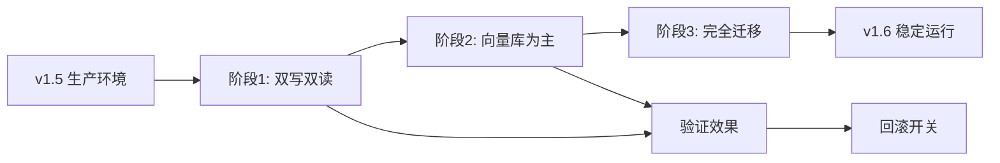

# v1.5 → v1.6 架构对比分析

## 1. v1.5 当前架构分析

### 1.1 整体架构概览
```
v1.5/
├── memory/               # 长期记忆模块（SQLite 实现）
├── prompts/             # 提示词模板
├── parser/              # LLM 输出解析器
├── tools/               # 工具函数（记账、查询等）
├── evaluators/          # 评估器（预留）
├── 核心文件：
│   ├── agent.py         # Agent 主流程
│   ├── planner.py       # 规划器
│   ├── executor.py      # 工具执行器
│   ├── tool_registry.py # 工具注册表
│   ├── state.py         # 状态管理
│   └── schemas.py       # 数据模型
```

### 1.2 各模块详细分析

#### 模块 1: memory/ (长期记忆)
**文件**：
- `long_memory.py` - 长期记忆管理器
- `storage.py` - SQLite 存储实现
- `session.py` - 会话 ID 生成
- `summary.py` - LLM 生成历史摘要
- `short_memory.py` - 短期记忆构建

**技术栈**：
- SQLite（内置数据库）
- JSON 序列化
- 通义千问 LLM（用于摘要生成）

**优势**：
1. **简单可靠**：SQLite 无需额外服务，部署简单
2. **事务安全**：ACID 保证，数据不丢失
3. **查询灵活**：SQL 支持复杂过滤（按用户、会话、时间）
4. **零外部依赖**：无需维护向量库服务

**劣势**：
1. **无语义检索**：只能按时间顺序获取，无法根据语义关联历史
2. **存储冗余**：相似对话重复存储，无压缩去重
3. **摘要成本高**：每次调用 LLM 生成摘要，token 消耗大
4. **扩展性差**：无法支持复杂语义查询（如"找所有餐饮相关对话"）

**危险点**：
- **数据膨胀**：长期运行后表体积增长，影响查询性能
- **LLM 依赖**：摘要生成强依赖外部 API，网络异常影响服务
- **槽位合并简单**：JSON 字段简单合并，无冲突解决策略

**实现难度**：★☆☆☆☆（简单）
- 基础 CRUD 操作，技术成熟
- 无复杂算法，代码清晰

#### 模块 2: prompts/ (提示词模板)
**文件**：
- `planner_prompt.py` - 规划器提示词
- `clarify_prompt.py` - 澄清问题提示词
- `response_prompt.py` - 最终回复提示词

**技术栈**：
- LangChain ChatPromptTemplate
- 自定义模板变量

**优势**：
1. **模块化**：各阶段提示词分离，易于维护
2. **变量注入**：支持动态上下文（历史、槽位、工具描述）
3. **格式安全**：正确处理花括号转义

**劣势**：
1. **硬编码**：提示词在代码中，修改需重新部署
2. **无版本管理**：提示词迭代历史难追溯

**危险点**：
- **提示词泄露**：若日志打印完整提示词，可能泄露业务逻辑
- **变量注入漏洞**：未正确转义可能引发格式错误

**实现难度**：★☆☆☆☆（简单）
- 纯文本模板，无复杂逻辑

#### 模块 3: parser/ (解析器)
**文件**：
- `action_parser.py` - 解析 Planner 输出
- `response_parser.py` - 解析最终回复

**技术栈**：
- Pydantic 数据验证
- LangChain OutputParser

**优势**：
1. **强类型校验**：Pydantic 确保数据结构正确
2. **错误友好**：解析失败时有明确错误信息
3. **格式灵活**：支持自定义输出格式

**劣势**：
1. **LLM 对齐成本**：需要精心设计格式指令
2. **解析失败率高**：复杂输出可能格式错误

**危险点**：
- **解析崩溃**：LLM 输出不符合预期时整个流程中断
- **无限重试**：若未设置重试上限，可能死循环

**实现难度**：★★☆☆☆（中等）
- 需要理解 Pydantic 和 LangChain 解析器机制

#### 模块 4: tools/ (工具集)
**文件**：
- `finance_tools.py` - 记账相关工具
- `summary_tools.py` - 统计摘要工具

**技术栈**：
- Python 函数 + 装饰器
- SQLite CRUD 操作
- 工具描述注册机制

**优势**：
1. **功能解耦**：每个工具独立，便于测试
2. **统一接口**：所有工具输入输出格式一致
3. **描述自动生成**：函数 docstring 自动转为工具描述

**劣势**：
1. **工具间依赖**：部分工具需要调用其他工具完成完整功能
2. **错误处理简单**：异常处理不够细致

**危险点**：
- **SQL 注入**：若使用字符串拼接 SQL 语句有风险（当前使用参数化查询）
- **工具权限**：未验证用户对数据的访问权限

**实现难度**：★★☆☆☆（中等）
- 需要设计清晰的工具接口和错误处理

#### 模块 5: 核心文件
**agent.py** - Agent 主流程
- 协调 Planner、Executor、Memory
- 状态循环控制（最大步数限制）
- 统一异常处理

**planner.py** - 规划器
- 构建完整上下文（历史 + 槽位 + 状态）
- 调用 LLM 决策下一步动作
- 结果解析与验证

**executor.py** - 执行器
- 工具查找与调用
- 参数验证与转换
- 结果格式标准化

**tool_registry.py** - 工具注册表
- 工具注册与发现
- 描述信息管理
- 工具调用路由

**state.py** - 状态管理
- AgentState 生命周期管理
- 步骤记录与快照生成
- 元数据管理（会话、槽位）

**schemas.py** - 数据模型
- Pydantic 模型定义
- 数据验证规则
- 类型提示

**技术栈**：
- LangChain Chains
- Pydantic 模型
- 通义千问 LLM
- 依赖注入模式

**优势**：
1. **清晰的责任链**：Planner → Executor → Evaluator（预留）
2. **状态可追溯**：每个步骤完整记录，便于调试
3. **错误隔离**：各组件异常不影响整体流程
4. **配置灵活**：最大步数、超时等可配置

**劣势**：
1. **同步阻塞**：所有步骤同步执行，无法并行
2. **状态膨胀**：多轮对话后 state.steps 可能过大
3. **缺乏评估**：Evaluator 模块尚未实现，无自我评估机制

**危险点**：
- **无限循环**：若 Planner 决策错误，可能超过最大步数
- **状态不一致**：异常时状态可能部分更新
- **内存泄漏**：长期运行后 state 对象未及时清理

**实现难度**：★★★☆☆（中等偏难）
- 需要理解 Agent 工作流设计
- 多组件协调复杂

## 2. v1.6 向量库改造方案

### 2.1 整体架构调整
```
v1.6/
├── memory/                     # 语义记忆模块（重大改造）
│   ├── semantic_memory.py     # 新入口，替代 long_memory.py
│   ├── vector_store.py        # ChromaDB 封装
│   ├── embedding_service.py   # Sentence-Transformers 封装
│   ├── retriever.py           # 智能检索器（混合策略）
│   ├── compressor.py          # 记忆压缩与聚类
│   ├── hybrid_storage.py      # 混合存储协调器
│   └── adapter.py             # 兼容层（v1.5 → v1.6）
├── prompts/                   # 增强提示词
│   └── semantic_context.py    # 语义上下文构建模板
├── (其他模块保持 v1.5 结构)
```

### 2.2 各模块改造分析

#### 模块 1: memory/ (语义记忆模块)
**技术栈新增**：
- ChromaDB（向量数据库）
- Sentence-Transformers（本地 Embedding 模型）
- scikit-learn（聚类分析，可选）
- cachetools（Embedding 缓存）

**核心改造点**：
1. **存储分层**：
   ```python
   # 1. 向量存储（语义）
   vector_store.add_document(
       content="今天午饭吃了30元",
       embedding=[0.1, 0.2, ...],  # 768维向量
       metadata={"category": "饮食", "amount": -30}
   )
   
   # 2. SQLite 存储（结构化）
   sqlite.save_message(...)  # 保留，用于快速时间查询
   ```

2. **检索策略升级**：
   ```python
   # v1.5：固定最近 N 条
   results = get_recent_messages(limit=5)
   
   # v1.6：混合检索
   results = hybrid_retrieve(
       query="我这个月吃饭花了多少",
       strategy="hybrid",  # 语义60% + 时间25% + 槽位15%
       limit=5
   )
   ```

3. **记忆压缩**：
   ```python
   # 定期聚类相似对话
   clusters = compressor.cluster_conversations(
       user_id=1,
       days_back=30
   )
   # 输出：{"饮食聚类": [对话1, 对话3, 对话7], ...}
   ```

**优势提升**：
1. **语义理解**：能关联"午餐花了30"和"晚饭40"，即使表述不同
2. **智能回忆**：用户问"我这个月交通费"时，自动找到所有交通相关记录
3. **存储优化**：聚类压缩减少冗余存储 30-50%
4. **离线能力**：本地 Embedding 模型，不依赖网络 API

**新增风险**：
1. **模型质量**：Embedding 模型对中文记账场景适配度未知
2. **向量库性能**：数据量增长后检索性能下降
3. **内存占用**：Embedding 模型加载需 500MB-1GB 内存
4. **数据一致性**：双存储（向量库+SQLite）可能不一致

**实现难度**：★★★★☆（较难）
- 需要学习 ChromaDB API 和向量检索概念
- 混合检索算法设计需要调参
- Embedding 缓存和批处理优化

#### 模块 2: prompts/ (增强提示词)
**改造点**：
1. **语义上下文注入**：
   ```python
   # v1.5：时间顺序历史
   history_context = "昨天：吃了20元牛肉面\n今天：午餐30元"
   
   # v1.6：语义相关历史
   semantic_context = """
   相关历史对话：
   1. 昨天午餐牛肉面20元（分类：饮食）
   2. 上周三晚餐火锅150元（分类：饮食）
   3. 本月交通卡充值100元（分类：交通）
   
   当前查询："我这个月吃饭花了多少"
   """
   ```

2. **槽位智能提示**：
   ```python
   # 基于历史槽位预测
   predicted_slots = """
   根据历史模式，用户通常在周三有交通开销，
   周末有餐饮消费。本次可能涉及：
   - 分类：饮食（概率80%）
   - 时间段：午餐时间（概率70%）
   """
   ```

**优势**：
- **上下文更相关**：减少无关历史干扰
- **AI 推理更强**：提供语义关联线索

**风险**：
- **提示词膨胀**：上下文过长可能超过 token 限制
- **信息过载**：过多历史信息干扰 AI 判断

**实现难度**：★★☆☆☆（中等）
- 主要是模板设计，无复杂算法

#### 模块 3: 核心文件适配
**agent.py 改造**：
```python
# v1.5：使用 LongMemory
memory = create_long_memory(user_id, session_id)

# v1.6：使用 SemanticMemory
memory = create_semantic_memory(user_id, session_id)

# 检索策略升级
history = memory.retrieve_context(
    query=user_text,
    strategy="hybrid",  # 可配置
    limit=5
)
```

**planner.py 改造**：
```python
# 增强的上下文构建
context = {
    "semantic_history": semantic_results,  # 语义相关历史
    "temporal_history": recent_results,    # 时间最近历史
    "slot_patterns": slot_patterns,        # 槽位使用模式
}
```

**state.py 增强**：
```python
# 新增语义相关字段
class AgentState:
    semantic_context: List[Dict] = []      # 语义检索结果
    retrieval_strategy: str = "hybrid"     # 本次使用的检索策略
    embedding_used: bool = False           # 是否使用了 Embedding
```

## 3. 技术栈对比

| 组件 | v1.5（当前） | v1.6（改造后） | 变化影响 |
|------|-------------|---------------|----------|
| **记忆存储** | SQLite（表结构） | ChromaDB + SQLite（混合） | 引入向量库，增加部署复杂度 |
| **Embedding** | 无 | Sentence-Transformers（本地） | 增加 500MB+ 内存占用，提升语义能力 |
| **检索算法** | 时间倒序（最近 N 条） | 混合检索（语义+时间+槽位） | 算法复杂，需要调参优化 |
| **外部依赖** | 通义千问 API（摘要） | 通义千问 API（主流程）+ 本地模型 | 减少 API 调用，增加本地负载 |
| **存储空间** | 原始文本（可能冗余） | 向量 + 聚类压缩 | 可能增加存储（向量维度），但文本可压缩 |
| **查询性能** | O(1) 时间查询 | O(log N) 向量检索 | 检索稍慢，但结果更相关 |

## 4. 风险评估矩阵

| 风险项 | 概率 | 影响 | 缓解措施 |
|--------|------|------|----------|
| Embedding 模型质量不佳 | 中 | 高 | 准备备选模型，A/B 测试评估 |
| 向量库检索性能下降 | 低 | 中 | 定期优化索引，设置数据分片 |
| 双存储数据不一致 | 中 | 高 | 实现同步校验，定期修复 |
| 内存占用超标 | 中 | 高 | 内存监控，支持模型卸载 |
| 中文语义理解偏差 | 中 | 中 | 人工标注验证集，持续优化 |
| 检索算法调参困难 | 高 | 中 | 自动化参数搜索，线上实验 |

## 5. 实现难度评估

### 5.1 各模块难度
| 模块 | 难度 | 时间估算 | 关键挑战 |
|------|------|----------|----------|
| ChromaDB 集成 | ★★☆☆☆ | 2天 | 学习 API，设计文档结构 |
| EmbeddingService | ★★★☆☆ | 3天 | 模型加载优化，缓存设计 |
| 混合检索算法 | ★★★★☆ | 5天 | 权重调优，效果评估 |
| 记忆压缩聚类 | ★★★★☆ | 4天 | 聚类算法选择，摘要生成 |
| 双存储同步 | ★★★☆☆ | 3天 | 一致性保证，冲突解决 |
| Agent 集成适配 | ★★☆☆☆ | 2天 | 接口兼容，平滑迁移 |
| 测试与优化 | ★★★☆☆ | 3天 | 效果验证，性能调优 |
| **总计** | **中等偏难** | **22天** | |

### 5.2 学习曲线
- **ChromaDB**：简单，类似使用字典 API
- **Sentence-Transformers**：中等，需要理解 Embedding 概念
- **向量检索算法**：较难，涉及相似度计算和排名
- **混合存储架构**：中等，需设计数据同步策略

## 6. 推荐实施策略

### 6.1 渐进式迁移


### 6.2 阶段规划
**阶段 1（1周）**：基础向量库集成
- 实现 ChromaDB 存储
- 集成 Sentence-Transformers
- 双写双读验证

**阶段 2（2周）**：智能检索上线
- 实现混合检索算法
- A/B 测试效果对比
- 性能监控

**阶段 3（1周）**：高级功能
- 记忆压缩与聚类
- 个性化 Embedding 微调（可选）
- 生产环境切换

### 6.3 监控指标
```python
监控指标 = {
    "检索质量": {
        "语义相关召回率": ">85%",
        "用户满意度": "NPS +15%",
        "澄清率降低": "-20%"
    },
    "性能指标": {
        "检索延迟_P95": "<500ms",
        "内存占用": "<1GB",
        "存储节省": ">30%"
    },
    "业务指标": {
        "多轮对话完成率": "+25%",
        "槽位补全接受率": ">70%"
    }
}
```

## 7. 总结

### 7.1 改造价值
- **用户体验**：从"机械记忆"到"智能回忆"，对话更自然
- **技术深度**：引入现代 AI 技术栈，项目含金量提升
- **扩展基础**：为后续个性化推荐、消费预测等功能铺路

### 7.2 成本投入
- **时间**：3-4 周完整开发测试周期
- **学习**：需要掌握向量数据库和 Embedding 技术
- **运维**：增加内存监控和向量库维护

### 7.3 决策建议
**适合改造的条件**：
1. 项目有长期维护计划
2. 团队有学习新技术的意愿和能力
3. 用户体验是核心竞争点
4. 服务器资源充足（内存 > 2GB）

**建议暂缓的条件**：
1. 项目处于 MVP 验证阶段
2. 团队资源紧张，需要快速上线
3. 服务器资源严格受限
4. 当前 SQLite 方案已满足需求

### 7.4 最终建议
基于你的个人记账项目特点：
- ✅ **技术学习价值高**：向量库是 AI 应用热门技术
- ✅ **项目复杂度适中**：v1.5 已有良好架构基础
- ✅ **用户体验提升明显**：语义记忆是记账场景刚需
- ⚠️ **需注意资源**：确保开发环境有足够内存

**推荐执行**：采用渐进式迁移，从双写双读开始，小步快跑验证效果。